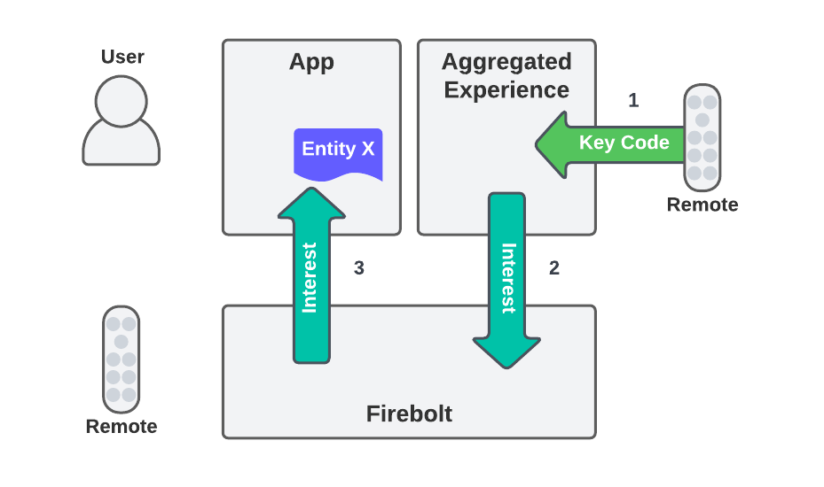
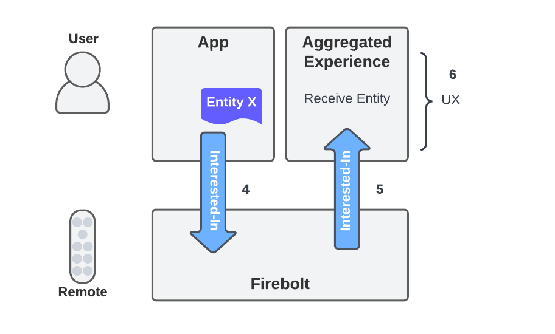

# User Interest Intents

Document Status: Candidate Specification

See [Firebolt Requirements Governance](../../governance.md) for more info.

| Contributor    | Organization   |
| -------------- | -------------- |
| Eugene Chung            | Comcast            |
| Tim Dibben            | Sky            |
| Mike Horwitz            | Comcast            |
| Jeremy LaCivita            | Comcast            |

## 1. Overview

In additional to traditional discovery APIs such as Watch History and
Watch Next, Firebolt provides a more abstract API that facilitates
impromptu content discovery connections between first-party Aggregated
Experiences and third-party Apps.

The User Interest Capability enables Apps to provide meta-data on
content that the user has expressed an interest in to Aggregated
Experience Apps that have been given access to use this Capability.

This allows for open ended design of Aggregated Experience App features
that present App-specific content to re-engage the user with the content
inside the originating App.

While the functionality and UX is left to the Aggregated Experience App,
typically designed by each Firebolt Distributor, the Firebolt API
enables events to register user interest and pass entity meta-data:


Which generally enables Aggregated Experiences to present that entity
meta-data in some way that leads to re-launching the original App at a
later point, using a `navigateTo` notification:


This is just one example of what an Aggregated Experience App might do
with the User Interest API.

Note that this API **SHOULD NOT** be used to implement Watch History or
Watch Next features. These concepts are much more fundamental to
Firebolt and have explicit APIs so that Firebolt Distributors can keep
track of which apps are using them separately.

## 2. Table of Contents
- [1. Overview](#1-overview)
- [2. Table of Contents](#2-table-of-contents)
- [3. User Interest from an in-app UX](#3-user-interest-from-an-in-app-ux)
- [4. User Interest from a platform UX](#4-user-interest-from-a-platform-ux)
  - [4.1. Upstream User Interest Intent](#41-upstream-user-interest-intent)
- [5. User Interest Bulk Updates](#5-user-interest-bulk-updates)
- [6. Core SDK APIs](#6-core-sdk-apis)
  - [6.1. InterestType](#61-interesttype)
  - [6.2. Discovery.userInterest](#62-discoveryuserinterest)
  - [6.3. Discovery Interest Provider](#63-discovery-interest-provider)
  - [6.4. InterestIntent](#64-interestintent)
- [7. Discovery SDK APIs](#7-discovery-sdk-apis)
  - [7.1. Content.requestUserInterest](#71-contentrequestuserinterest)
  - [7.2. Content.onUserInterestedIn](#72-contentonuserinterestedin)
  - [7.3. InterestedInIntent](#73-interestedinintent)


## 3. User Interest from an in-app UX

Some Apps will have a built-in user interface for users to express
interest in content from the App. This could be a "Favorite" button,
an in-app "My List" button, etc.

If the App wants to leverage any additional exposure from the device's
Aggregated Experience, it can wire up its own UI to the Firebolt User
Interest API, in addition to any in-app features that it's already
invoking.

By calling the `Discovery.userInterest` method with the relevant entity
meta-data, the device\'s Aggregated Experience will be notified of the
user's interest in that entity:

```typescript
Discovery.userInterest(type:UserInterestType, entity:EntityInfo)
```

The type parameter denotes what sort of interest:

-   `interest`
-   `disinterest`

An app **MUST** `provide` the `xrn:firebolt:capability:discovery:interest`
capability in order to call `Discovery.userInterest`.

When this method is called with a valid `EntityInfo`, the platform
**MUST** dispatch a `Content.onUserInterestedIn` notification to all Apps
that have registered for it (typically Aggregated Experience Apps) with
information about the app, interest type, and the entity.

The `Content.onUserInterestedIn` event has the `InterestedInIntent` as its
data.

An Aggregated Experience can register for the `Content.onUserInterestedIn`
notification, and it will receive notifications when an `EntityInfo` is
returned from the active App after a `Discovery.userInterest` call is
fulfilled.

An app **MUST** have permissions to `use` the
`xrn:firebolt:capability:discovery:interest` capability in order to 
listen to the `Content.onUserInterestedIn` notification.

If the result is `null` or is not a valid entity, i.e. does not match
the [EntityInfo](../entities/) schema, then no `Content.onUserInterestedIn`
notification will be dispatched.

The `Discovery.userInterest` method **SHOULD NOT** be used in place of more
specific Discovery methods, e.g. `Discovery.watchNext` or
`Discovery.watched`. These methods facilitate specific UX flows that may
have separate legal opt-outs for each user.

The `Discovery.userInterest` method **SHOULD NOT** be called unless the user
is activating a UI element in the app, or in a second screen experience
that is communicating with the app, that implies interest of some kind.

## 4. User Interest from a platform UX

Firebolt platforms may provide a platform UX, e.g. voice or and RCU, to
express user interest in content from an active App. To facilitate this
Apps will need to be told about the user\'s expressed interest in their
content.

First, the Aggregated Experience (or some app with the correct
capability) detects that the user is interested in something. In this
picture the interest is triggered by an RCU button, but how this occurs
is outside the scope of this document. When this happens, the Aggregated
Experience app calls `Content.requestUserInterest()`, which will trigger the
foreground app's UserInterest provider and call it's `userInterest` method
by invoking the RPC method `Discovery.onRequestUserInterest`.



Next, the foreground app receives and responds to the request with an 
EntityInfo, which is returned as the result to the pending
`Content.requestUserInterest` method:



Once an App's callback is invoked, that app will have `interestTimeout`
milliseconds to return a value or throw an error. Values returned after
that time **MUST** be ignored. The timeout value is stored in the
device's configuration manifest.

To be notified when a user expresses interest in the currently displayed
content, an App **MUST** provide the
`xrn:firebolt:capability:discovery:interest` capability by enabling the
`Discovery.onRequestUserInterest` notification.

If there is a valid entity to return, then the method registered by the
App **MUST** return the currently displayed entity meta-data.

If there is no valid entity to return, then the method **MUST** throw an
exception.

If the foreground App returns a valid `EntityInfo` before the timeout,
then, the returned value **MUST** be used.

### 4.1. Upstream User Interest Intent
In some cases, e.g. a voice assistant, some upstream component will inform
the platform that the user is interested in whatever is currently being presented.

To do this, the upstream system **MUST** send a `UserInterest` intent, which describes the type of interest.

When a Firebolt platform receives this intent, it **SHOULD** initiate the platform's [user interest flow](#4-user-interest-from-a-platform-ux).

## 5. User Interest Bulk Updates

Sending bulk interest updates, e.g. Entities the user expressed interest
in on a different platform, is not supported.

## 6. Core SDK APIs

The following APIs are exposed by the Firebolt Core SDK as part of the
`Discovery` module.

### 6.1. InterestType
This is an enum with the following values:

- `"interest"`
- `"disinterest"`

### 6.2. Discovery.userInterest

This is a push API that allows Apps to push entities that the user has
expressed interest in to the platform.

To push an entity that the user is interested in pass an `EntityInfo`
object to the method:

```typescript
Discovery.userInterest(type: InterestType, entity: EntityInfo): Promise<void>
```

### 6.3. Discovery Interest Provider
To respond to requests for the current entity, because the user has
expressed interest in some way that the platform manages, register a
provider:

```typescript
interface IDiscoveryInterestProvider {
  function userInterest(type: InterestType): Promise<EntityInfo>
}

Discovery.provide("xrn:firbolt:capability:discovery:interest", IDiscoveryInterestProvider)
```

### 6.4. InterestIntent

An `InterestIntent` denotes that the user has expressed interest in the
currently displayed and/or selected content:

```typescript
type InterestIntent {
  action: "interest"
  data: {
    type: "interest"
  },
  context: {
    source: "rcu" | "voice"
  }
}
```

## 7. Discovery SDK APIs

The following APIs are exposed by the Firebolt Discovery SDK as part of the
`Content` module.

### 7.1. Content.requestUserInterest
This method triggers the corresponding Discovery provider API for the
foreground app.

```typescript
Content.requestUserInterest(type: InterestType): Promise<EntityInfo>
```

### 7.2. Content.onUserInterestedIn

This notification allows Aggregated Experience Apps to be informed when
a user expresses interest in some Content, and the content resolves to a
valid Entity from some App.

`Content.listen('userInterestedIn', InterestedInIntent => void): Promise<void>`

The callback will be passed an `InterestedEventData` object with
information about the entity that the user expressed interest in.

### 7.3. InterestedInIntent

`InterestedInIntent` provides information about what the user has
expressed interest in:

```typescript
type InterestedInIntent {
  action: "interestedIn",
  data: {
    appId: string,
    type: InterestType,
    entity: EntityInfo
  }
}
```
